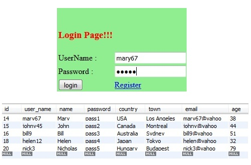
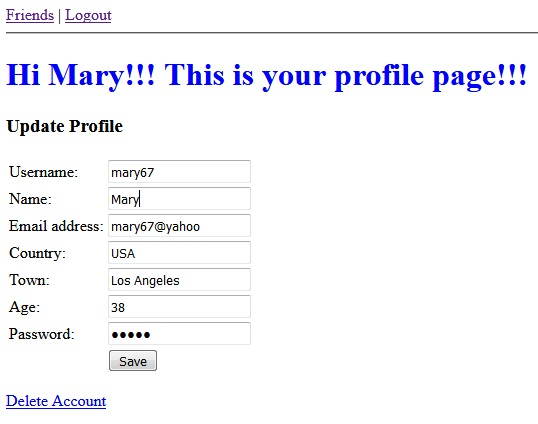

# LoginRegistration
Login and Registration using Maven, JSP, Servlet, JSTL, JDBC and SQL. Also it has a Servlet Filter to secure the pages. 

This Login & Registration is an MVC app that uses the so called "JavaBeans" and "DAOs" - standing for Data Access Objects - to handle the interactions with the MySQL database. The app has a connection pool.

When a user logs in, check their password. The user’s password is stored in the database. When the user attempts to log in, 
we will compare the password with information in the database. 

A new user can easily register, filling username, name, password fields. After submitting form, the data will be stored in the database table. So that next time user can login with the login credentials which are used while user registration.

After log in, the user can update or delete his profile. The informations will be stored in the database or the user will be 
deleted from the database. 

I’m using session management for login/logout. Also URL rewriting is used for the case that the client doesn't support cookies.

The filter checks if the user is logged-in or not (by just checking the presence of a session attribute) and then continue the request or block it by redirecting back to the login page.
